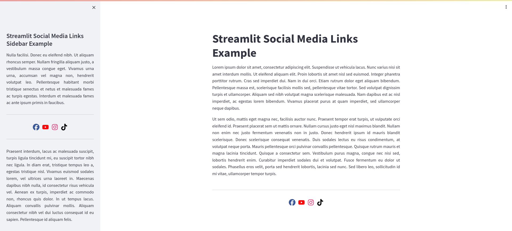
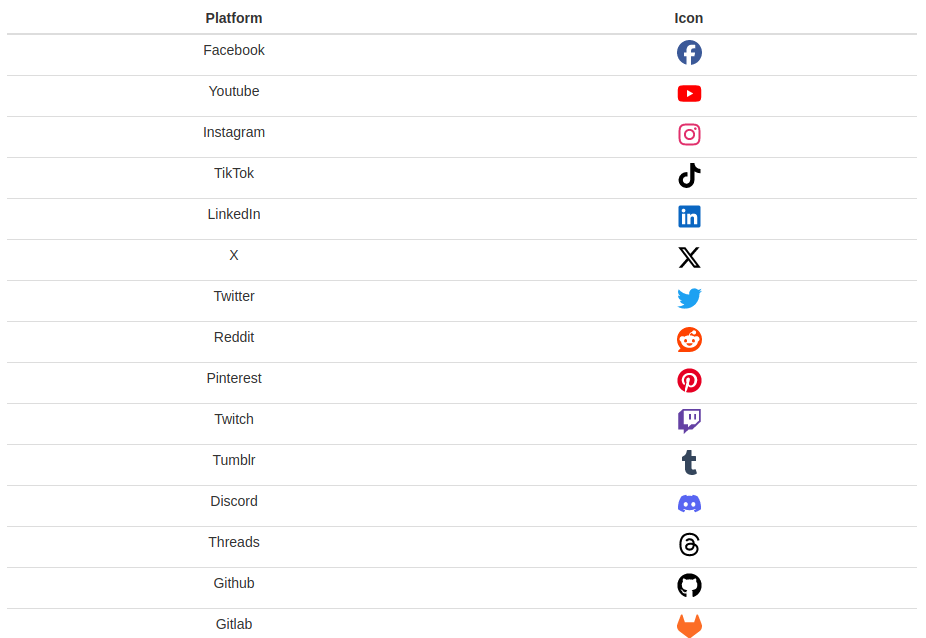

# st-social-media-links


[Live Demo](https://social-media-links.streamlit.app)

## About
A Python package designed to assist in displaying social media links within Streamlit apps.

## Install
```python
pip install st_social_media_links
```

## Usage
```python
from st_social_media_links import SocialMediaIcons

social_media_links = [
  "https://www.facebook.com/ThisIsAnExampleLink",
  "https://www.youtube.com/ThisIsAnExampleLink",
  "https://www.instagram.com/ThisIsAnExampleLink",
  "https://www.github.com/jlnetosci/st-social-media-links",
]

social_media_icons = SocialMediaIcons(social_media_links)

social_media_icons.render()
```

<p align="center" width="100%">
   
  </p>
  
  ---
  
  ### Customization options
  **`SocialMediaIcons`** takes two arguments: 
  
  - `social_media_links`: a list with web links. You can choose the order of the icons through the order of the web links, each icon will be displayed in its respective position. 

- `colors`: an optional list of custom colors for the icons. If it is not given, icons show their default color. If given, it should have the same length as `social_media_links`, if it does not, all icons will show their default color. Accepted values include [HTML color names](https://www.w3schools.com/tags/ref_colornames.asp), as well as HEX color codes.

```python
from st_social_media_links import SocialMediaIcons

social_media_links = [
  "https://www.facebook.com/ThisIsAnExampleLink",
  "https://www.youtube.com/ThisIsAnExampleLink",
  "https://www.instagram.com/ThisIsAnExampleLink",
  "https://www.github.com/jlnetosci/st-social-media-links",
]

colors = ["#000000", "Brown", "SteelBlue", "Lime"]

social_media_icons = SocialMediaIcons(social_media_links, colors)

social_media_icons.render()
```

<p align="center" width="100%">
   
  </p>
  
  ----
  
  If you do not want to customize all colors, you can use `None` at any index in `colors` and that icon will show its default color.

```python
from st_social_media_links import SocialMediaIcons

social_media_links = [
  "https://www.facebook.com/ThisIsAnExampleLink",
  "https://www.youtube.com/ThisIsAnExampleLink",
  "https://www.instagram.com/ThisIsAnExampleLink",
  "https://www.github.com/jlnetosci/st-social-media-links",
]

colors = ["#000000", None, "SteelBlue", None]

social_media_icons = SocialMediaIcons(social_media_links, colors)

social_media_icons.render()
```
<p align="center" width="100%">
   
  </p>
  
  ----
  
  **`render`** has two optional arguments:
  
  - `sidebar` 

- `justify_content`

`sidebar` is a boolean and therefore can be `True` or `False`. Its default value is `False`. It is possible to render with both options simultaneously, if you want to display the icons with social media links in both the main-page and the sidebar, i.e.:
  
  ```python
social_media_icons.render(sidebar=False) #will render in the main-page
social_media_icons.render(sidebar=True) #will render in the sidebar
```

If you want to have the icons exclusively in the sidebar, you only need to render it once: 
  
  ```python
social_media_icons.render(sidebar=True) #will render in the sidebar
```

---
  
  `justify_content` gives some freedom regarding icon placement. In brief, it completes the [CSS `justify-content` property](https://developer.mozilla.org/en-US/docs/Web/CSS/justify-content) used, and therefore may take the same options e.g. `center`, `start`, `end`, `space-between`, `space-around`, `space-evenly`, etc. Its default value is `center`. `justify_content` can have different values for separate renderings: 
  
  ```python
# Rendering in the main-page with icons centered
social_media_icons.render(sidebar=False, justify_content="center")

# Rendering in the sidebar with icons evenly spaced
social_media_icons.render(sidebar=True, justify_content="space-evenly")
```

---
  
  ## Platforms supported
  
  In this version, **`st-social-media-links`** supports links to: 
  
  <p align="center" width="100%">
   
  </p>
  
  ## Tips
  
  When paired with `st.divider()` the icon sets look very aesthetically pleasing. 

Even though I have not tested it much, [`add_vertical_space`](https://arnaudmiribel.github.io/streamlit-extras/extras/add_vertical_space/) might help you achieve the positioning you want for your social media icons.

## Acknowlegments

For this project, I do have to acknowledge [Font Awesome](https://fontawesome.com/) for their huge selection of icons and the ease with which they implemented. The Awesome in their name is well deserved! 
  
Thanks to Raúl Pérula Martínez for suggesting the addition of Medium.